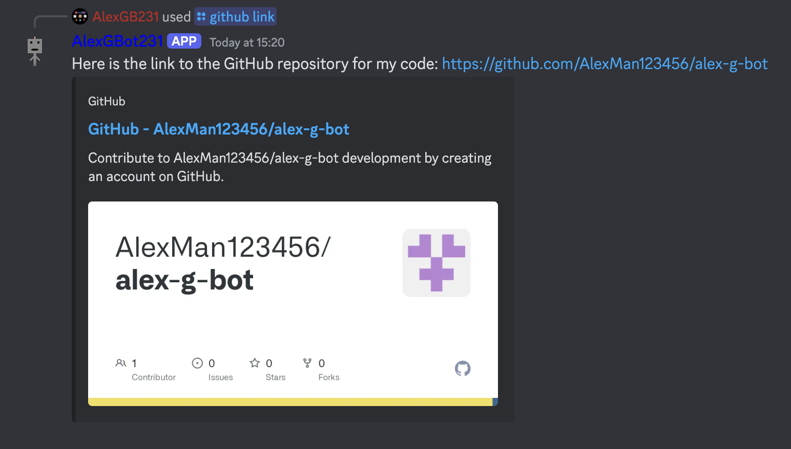

View information about the bot's GitHub repository.

## GitHub link
Get a link to the bot's GitHub repository.

### Usage
    /github link

### Response

## GitHub commits
View the most recent commits to the bot's GitHub repository.

### Usage
    /github commits

### Possible Response
![Commit history. 59c6494: Merge pull request #90 from AlexMan123456/change-colour-of-embed-of-github-commits-command. 13a5712: Changed colour of commits embed. c5d6c4a: Removed unnecessary comment. 37b2e35: Merge pull request #89 from AlexMan123456/display-amount-won-at-end-of-heads-or-tails. 11f36db: Enhanced game result display. 2128517: Made error message ephemeral. 7b45ce0: Merge pull request #88 from AlexMan123456/make-it-so-that-only-the-user-being-challenged-can-accept-challenge-invite. fd4371d: Made it so that only the user being challenged can accept a challenge invite. 12e676b: Fixed need for extraneous ephemeral message. 034cfe2: Merge pull request #87 from AlexMan123456/create-heads-or-tails-command](../../image-command-responses/general/github/github-commits.png)