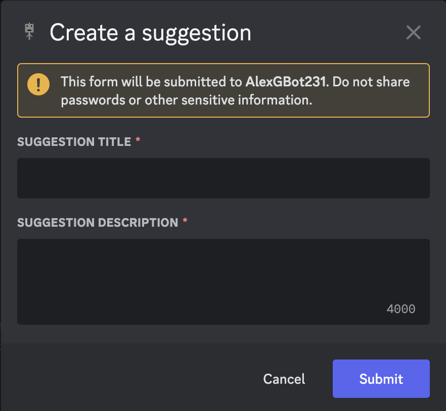
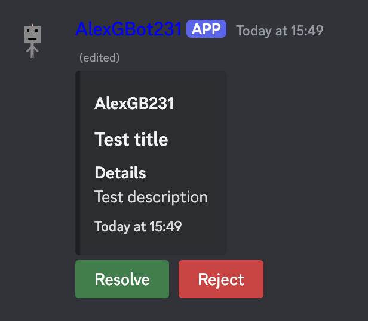
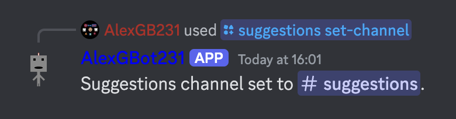

Manage your suggestions for potential bot features.

### Suggestions create
Suggest a feature to be added to the bot.

#### Example Usage
    /suggestions create
This will then show the following modal:

You would then proceed to enter some data into the modal.

#### Example Response
Entering "Test title" as suggestion title and "Test description" as suggestion description:

**NOTE: This message will appear ephemerally, as well as in the channel you've set as the suggestions channel in your server. If no suggestions channel has been set, this command will not run.**

### Suggestions view
View all suggestions you've made for the bot so far.

#### Usage
    /suggestions view

#### Example Response
![All suggestions. Test. Test. Status: resolved. Test. Test. Status: pending. This bot is good. I promise it is good. Status: resolved. I'm Captain Kevin, the best there is! I've been collecting treasure for the best of years!. Status: resolved. Test. Test. Status: pending. This bot is very good. Very good! Status: resolved. This bot is good. Very good! Status: rejected. Finally got it working! At long last. Status: pending. New suggestion! Suggestions are now entered by modals. / And so I can easily create a new line! Status: pending. Test title. Test description. Status: pending](../../image-command-responses/general/suggestions/suggestions-view.png)

### Suggestions set-channel [OWNER/MOD ONLY]
Set the channel you want to receive suggestions in.

#### Example Usage
    /suggestions set-channel channel:#suggestions

#### Options
`channel`: The channel to set as the suggestions channel.

#### Example Response

You will then receive any future suggestion made in your server in the #suggestions channel.